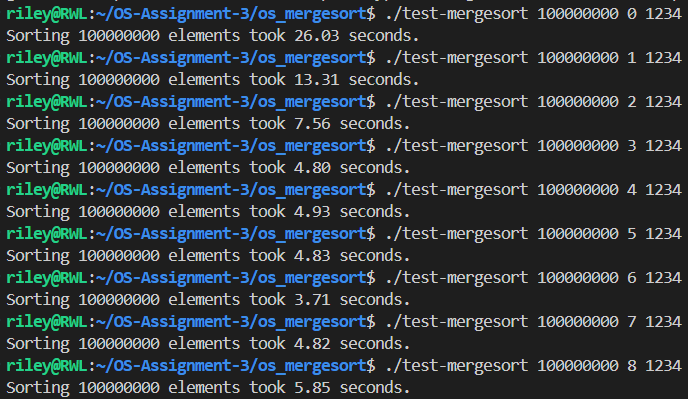

## Assignment 3 Concurrency

* Authors: Mohit Mittal, Riley Lienert
* Group name: Pair Group 1

## Overview

This program implements a parallel merge sort algorithm that utilises multi-threading to speed up sorting time. It achieves this by recursively dividing the array into subarrays, sorting them (in parallel up to a cutoff level) and then merging the results back together to produce a fully ordered array.

## Manifest

**Mergesort.c -** This file implements a parallel merge sort algorithm using pthreads that recursively spawns threads to sort subarrays until a cutoff depth is reached, after which a standard single-threaded mergesort is used.

**Mergesort.h -** Header file for mergesort.c, containing the global variables, structures and function prototypes all used in mergersort.c.

**Makefile -** This file defines how to compile and link this program, also cleaning any generated files when run.

**test-mergesort.c -** This file is used to test the program. When run, it sets up the array, the cutoff level and calls the merge sort functions.

## Building the project
It is a straightforward process to build this project simply:

1. Run:
```
make
```
in the terminal. Compiles the program, linking it into an executable file called **test-mergesort**

2. If you want to regenerate and test it again, run:
   -  ```make clean``` in the terminal (cleans all generated files).
   - ```make``` again to compile the .c files.

## Features and usage
**Features:**

1. Implements both sequential and parallel versions of merge sort.

2. Sorts subarrays in parallel using pthreads to create multiple threads.

3. Includes a cutoff level to control how many recursion levels use threading.

4. Automatically merges subarrays once their respective threads complete.

 **Usage:**

To run this program after building simply execute:
```
./test-mergesort <array_size> <cutoff_level>
```
**Arguments:**

<array_size> = the number of integers to be sorted.

<cutoff_level> = the depth of recursion where you want parallelism to stop.
 

## Testing

Testing was conducted using the provided test-mergesort.c file, which generates random integer arrays, runs the merge sort algorithm (sequential or parallel), and verifies the result using a built-in sorting check. The program also measures execution time for performance evaluation.

The correctness of both sequential and parallel merge sort implementations was verified by:

1. Running the test program with different array sizes and random seeds.

2. Comparing sorted results across multiple cutoff levels (thread depths).

3. Confirming the output “sorting failed!!!!” never appeared.

4. Confirming memory allocation/thread errors never appeared.

Test Examples:

```
./test-mergesort 10 0 1            # Very small array, sequential
./test-mergesort 100 1 5           # Small array with 1 level of threading
./test-mergesort 1000 2 42         # Medium array with moderate parallelism
./test-mergesort 100000 3 123      # Large array, 3 thread levels
./test-mergesort 1000000 4 77      # Very large array, 4 thread levels
./test-mergesort 100000000 100 49  # Massive array, too many thread levels
(Expected Error)
./test-mergesort 0 0 49            # Zero element array
(Expected Error)
```

**Performance:**

When running the program with n = 100,000,000 elements, speedup consistently improved with thread count. However, beyond a certain point (6 threads), performance begins to degrade due to higher thread overhead. Collectively, the best result came from 6 threads, in which the array was sorted in 3.71 seconds compared to 26.03 seconds with the single-threaded approach (7 x speedup). See image below:

<p align="center">
  
</p>


## Known Bugs

No known bugs exist in this program

## Reflection and Self Assessment

During development, the main challenge was understanding how the provided template and functions interacted. This required carefully reading the specification, analysing the starter code, and reviewing merge sort concepts through the background section and reference materials. Once the basic merge sort logic was understood, implementing the sequential version was straightforward.

Adding parallelism was initially unfamiliar but became clear after revisiting the textbook sections on concurrency and the use of pthread_create and pthread_join. With the provided data structure for passing thread arguments, implementing multithreading mainly involved managing thread creation and merging.

Most issues arose from small implementation mistakes such as forgetting to free dynamically allocated argument structures and mistakenly using a while loop instead of an if statement for the cutoff condition. After identifying and correcting these errors through testing and code review, the program ran efficiently. Overall, the process went smoothly, and understanding how recursive functions interact with threads was a key concept that “clicked” during this project. Testing also exceeded expectations, with the multi-threaded implementation producing a large speedup, further validating success.

## Sources Used

The primary resource used in this assignment was the Youtube video 'Algorithms: Merge Sort' (https://youtu.be/KF2j-9iSf4Q) which was featured in the assignment description. This explained the inner workings of the standard merge sort alogrithm and how to implement it in code. Overall, the general structure was followed when implementing our custom approach. Secondly, the textbook's (Operating Systems: Three Easy Pieces) concurrency chapter was read to understand pthreads and how to use the library.
